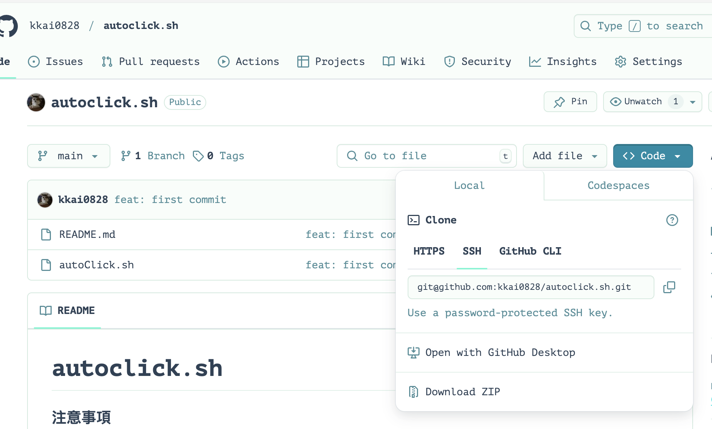

# autoclick.sh

### 注意事項

-   此程式目前僅限 macbook 用戶使用
-   僅限掛產物課程使用
-   此程式每三分鐘會點擊畫面兩次，讓影片暫停再播放，並在30分鐘後自動結束程式，推薦每 30 分鐘登出產物課程累積時數
-   本程式目前僅負責暫停，登出等功能請自行操作

## 操作方式：

1. 下載 autoClick.sh 並將他放到桌面  
    -   
    - 點 Code 按 Download zip 
    - 解壓縮後把資料夾內的 autoClick.sh 拉到桌面
2. 按下 command + 空白鍵
3. 輸入 terminal 或 終端機 打開終端機
4. 回到產物課程畫面開始播放影片
5. 在終端機輸入 `~/Desktop/autoClick.sh` 並按下輸入開始執行
6. 回到產物課程畫面並確認程式運作正常
7. 30 分鐘後程式將自行結束，此時重複步驟 4~6 即可進行下一輪，推薦每30分鐘先登出累積課程時數

-   請留意有時候可能會有 bug 導致暫停後沒有繼續播放，此時需自行恢復播放
